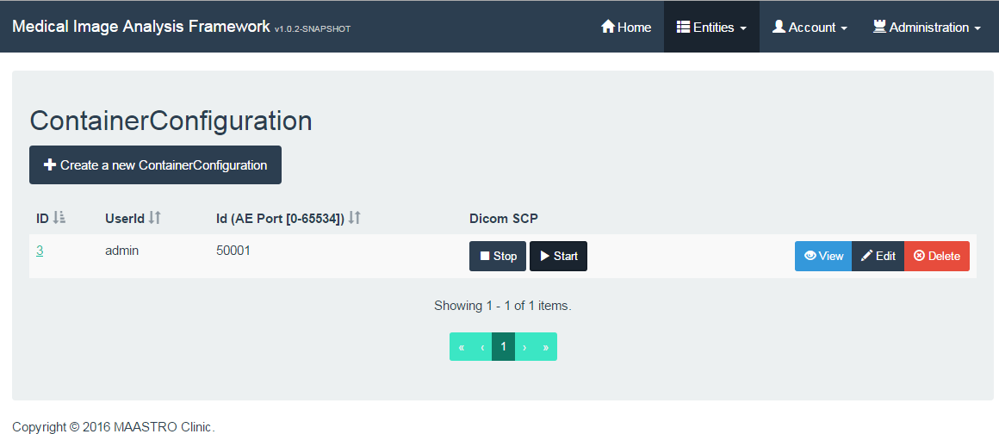

# MIA - Medical Image Analysis - GUI

The MIA framework is designed for performing calculations on large volumes DICOM data in the domain of Radiation Therapy. 

## [General Framework README.md](https://bitbucket.org/maastrosdt/mia/src/master/src/main/resources/README/README.md) ##

The MIA framework is composed out of several [microservices](http://martinfowler.com/articles/microservices.html). Each microservice is Java application build with Spring (Boot & Cloud). Most of the MIA documentation is not microservice specific! **The non-microservice specific documentation can be found [here](https://bitbucket.org/maastrosdt/mia/src/master/src/main/resources/README/README.md).**

## Prerequisites ##

- Java 8
- 1 GB RAM
- Modern browser

## Usage ##

**Flow Overview**

1. Create a 'Volume of Interest' (VOI): a VOI is a volume based on a single or a combination of structures present in the RTSTRUCT. For structure naming the [RTOG](https://en.wikipedia.org/wiki/Radiation_Therapy_Oncology_Group) [Standardized Naming Conventions](http://www.redjournal.org/article/S0360-3016(11)03327-X/abstract) are used. Non RTOG tagged RTSTRUCT structures, can be mapped using the (micro) mappingservice.
2. Create one ore more 'Computation(s)': a single computation for your dicom data
3. Create a 'ContainerConfiguration': a selection of computations you want to execute on a container

When a containerconfiguration is saved, the **"start"** button in the containerconfiguration overview will open the selected Dicom port on the (micro) fileservice. The system is ready to perform computations!

1. Send DICOM files "e.g. storescu command line application from the [DCMTK DICOM Toolkit](http://dicom.offis.de/dcmtk.php.en), example: `storescu +sd +r -aec FILESERVICE localhost 50001 "C:\DICOMData\12345" -v` `storescu +sd +r -aec FILESERVICE address_fileservice container_configuration_port "DICOM_PATIENT_FOLDER" -v`"
2. The fileservice create a referenced based DICOM packages from the incoming DICOM data
3. After some moments containers should be visible in the container overview of the GUI
4. Validated containers will be scheduled for calculation

See detailed description below.

 
**Login**

Navigate to the http://localhost:8080 (or use Eureka to find address and port)

Login with (account > signin):

- user: admin
- password: admin

### Entities ###

**VolumeOfInterest**

> The volume or combination of volumes to analyse.

Create or edit a Volume of interest:

- Select from the dropdown a RTOG and click the add button
- Create combinations for RTOGs using the plus and minus operations
- The list of operators should be 1 smaller than the list of RTOGs
- Example: Lung L + Lung R

**Computation**

> A single computation for your dicom data.

ComputationIdentifier: The label for the result in the result service

Modules: 

- DoseComputation:
	- Operatation: min/mean/max: Get either the minimum, mean or maximum dose for the volume of interest.
- DvhCurveComputation:
	- Absolute Output: Specify whether an absolute or relative DVH curve will be put out.
	- Binsize: output can be given relative (in percentage) or absolute (in Gray).
- DvhDoseComputation:
	- Volume Type: Specify whether the volume is provided as a percentage or an absolute value in cc.
	- Absolute Output:
		- true: output is given in Gray (absolute).
		- false: output is given in a percentage (relative).
	- Limit: The volume in either percentage of cc to get the D parameter for.
- DvhVolumeComputation
	- Absolute Output: output can be given relative (in percentage) or absolute (in cc).
	- Limit:The dose in Gray to compute the V parameter for.
- VolumeComputation

**ContainerConfiguration**

> All computations you want to execute on a container.

Dicom Files send under the called userId (Called AE title) and configurationId (AE port) will be analysed with the ContainerConfiguration as configured in this screen.

- User Unique Config Id: The is AE port used on the fileservice in range [0, 65534].
- Computation: dragable list of computations, the order will be taken into account

After saving a container, the **start** button can be used to open the DICOM port on the fileservice. The system is ready to compute!

**Containers**

After sending DICOM data to the fileservice, referenced DICOM packages will be created, and containers should become visible in the GUI.

> The container page shows all containers present in the container service. A container contains a DICOM package (referenced dicom filelocations), configuration and mappings

For more detailed information about containers, see the containerservice README.

In the GUI the containers can be viewed, deleted, configured and mapped by their respective buttons. The map button brings you directly to the mapping tool with the respective rois and rtogs.

The search field can currently search through ContainerStatus, PatientId, UserId and ConfigurationId., making this a versatile search field.

ContainerStatus:

- IDLE: Container is retrieved, no actions performed (this is likely to be an error in the network/speed or configuration)
- CONFIGURATIONERROR: Configured configuration cannot be retrieved
- MAPPINGERROR: Container structures cannot be mapped, use the 'map' button to perform mappings
- VALIDATIONERROR: Container does not fullfill all required (Modalities) for the configured calculations, the container can be removed
- QUEUE: Container is validated and scheduled for calculation
- CALCULATIONERROR: Calculation has an error
- CONNECTIONERROR: Calculation has stopped due to worker becoming unreachable
- DONE: The calculation is done and results are exported

## Development

This application is generated using JHipster, you can find documentation and help at [https://jhipster.github.io](https://jhipster.github.io).

Before you can build this project, you must install and configure the following dependencies on your machine:

1. [Node.js][]: We use Node to run a development web server and build the project.
   Depending on your system, you can install Node either from source or as a pre-packaged bundle.

After installing Node, you should be able to run the following command to install development tools (like
[Bower][] and [BrowserSync][]). You will only need to run this command when dependencies change in package.json.

    npm install

We use [Gulp][] as our build system. Install the Gulp command-line tool globally with:

    npm install -g gulp

Run the following commands in two separate terminals to create a blissful development experience where your browser
auto-refreshes when files change on your hard drive.

    ./mvnw
    gulp

Bower is used to manage CSS and JavaScript dependencies used in this application. You can upgrade dependencies by
specifying a newer version in `bower.json`. You can also run `bower update` and `bower install` to manage dependencies.
Add the `-h` flag on any command to see how you can use it. For example, `bower update -h`.

## Building for production

To optimize the colourfulnews client for production, run:

    ./mvnw -Pprod clean package

This will concatenate and minify CSS and JavaScript files. It will also modify `index.html` so it references
these new files.

To ensure everything worked, run:

    java -jar target/*.war --spring.profiles.active=prod

Then navigate to [http://localhost:8080](http://localhost:8080) in your browser.

## Testing

Unit tests are run by [Karma][] and written with [Jasmine][]. They're located in `src/test/javascript/` and can be run with:

    gulp test

