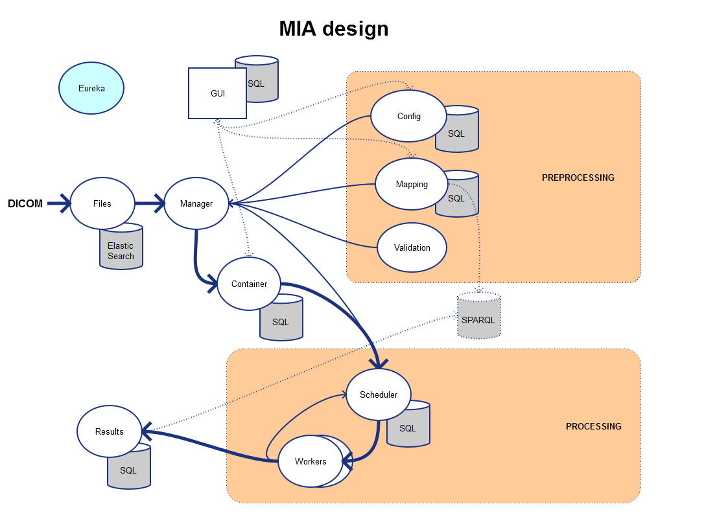
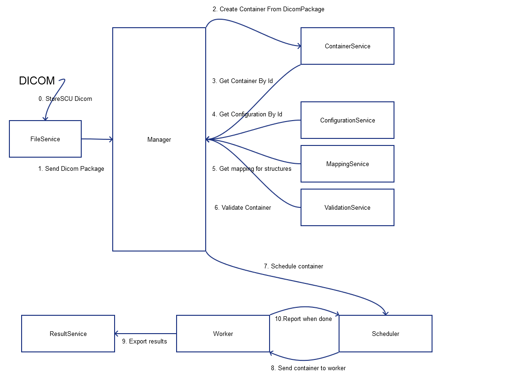
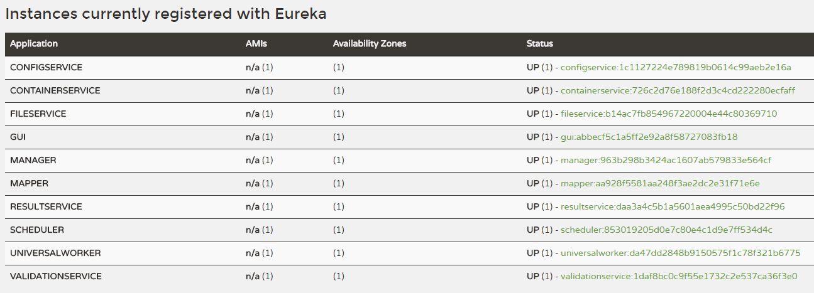
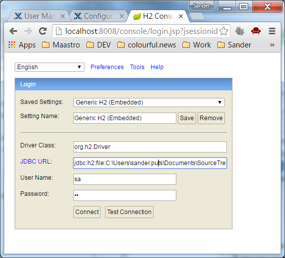
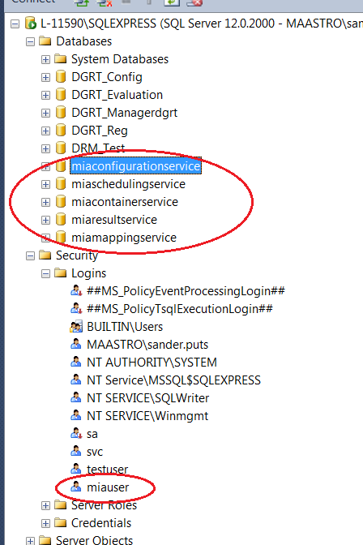
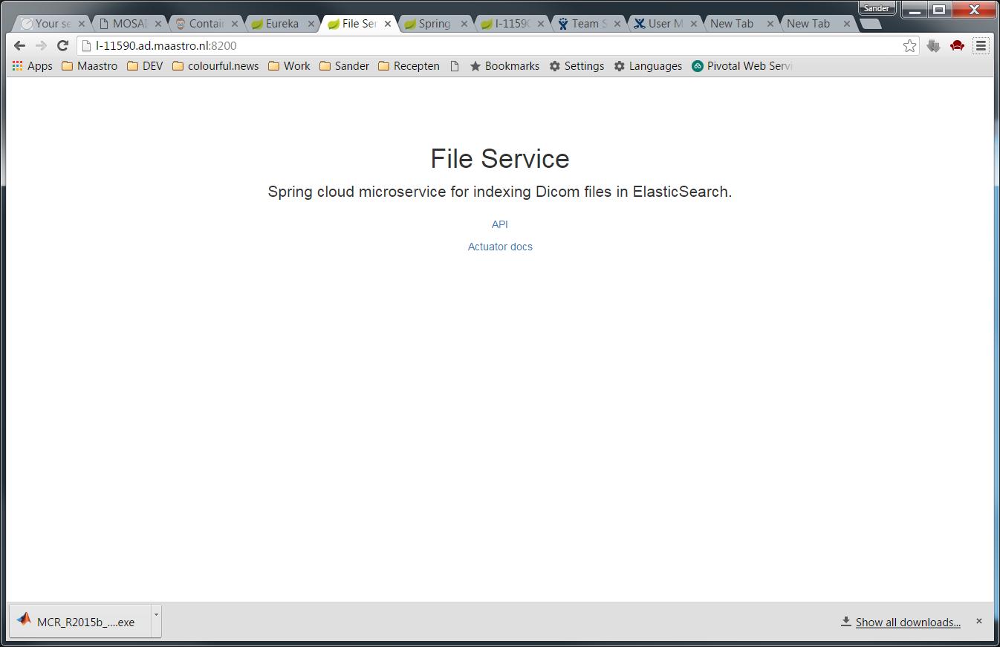

# MIA - Medical Image Analysis

The MIA framework is designed for performing calculations on large volumes DICOM data in the domain of Radiation Therapy. 

The MIA framework is composed out of several [microservices](http://martinfowler.com/articles/microservices.html). Each microservice is Java application build with Spring ([Boot](http://projects.spring.io/spring-boot/) & [Cloud](http://cloud.spring.io/spring-cloud-static/spring-cloud.html)). Most of the MIA documentation is not microservice specific! 

**This is the general MIA framework documentation. Microservice specific documentation can be found in the root README.md of each micro service repository**

### General Description ###

To make batch computations on large volumes DICOM data possible, the following tasks have to be solved:

- Sort Dicom files for computations:
	- Find referenced CT, RTPLAN, RTSTRUCT, RTDOSE
- Configure DICOM calculations with a user interface
- Map structures to standardized names (required for batch computation & results)
- Distribute MATLAB calculations and Java Dicom processing
- Store results in a single place

### MIA Microservices Overview ###

- File service:  indexes dicom headers to a document databases and creates patient packages for computations
- Manager: orchestrates the pre-processing flow
- Container service: stores all container information in JSON (patient package configuration + structure mappings)
- Configuration service: stores calculation configuration
- Mapping service: Maps custom structure names to standards
- Validation service: Validates containers before scheduled for calculations
- GUI: Single interface for all microservices
- Scheduling service: container queue and distribution to workers
- Workers: performs (Matlab) calculations on containers
- Result service: Stores calculation results

### MIA Microservices Flow (step by step) ###

## Installation ##

1. Check hardware requirements
2. Download applications (micro service jars) and distribute over machines
3. Install prerequisite software (micro service dependent)
4. Install the Discovery Server Eureka
5. Set the location of the Discovery Server as a system variable for each environment
6. Configure the databases (profile production only)
7. Configure the FileService (configure shared folder and permissions)
8. Configure the Workers (configure read permissions to FileService shared folder)
9. Check the permissions for workers and fileservice!
10. Configure the other Applications
11. Install the applications as a service (optional)
12. Run applications in the following order:
	1. ElasticSearch 
	2. Eureka 
	3. All others
13. Validate your installation

### Hardware Requirements ### 

- GUI (medium load)
	- 1GB RAM	
- FileService (heavy load)
	- Application 1GB RAM	
	- ElasticSearch 2GB+ RAM									
	- Storage space for Dicom data +2GB HD per patient
- Workers (heavy load)					
	- 4GB+ RAM
- All other (7x) MIA Micro Services (low load): 				
	- 512MB RAM

Possible but not recommended: run all services on a single machine SSD, 8GB, Quad-Core

### Software Requirements ### 

- MIA Microservices (all):
	- Java 8 Runtime 64-bit 
- Workers:
	- [Matlab MCR 9.0](http://nl.mathworks.com/products/compiler/mcr/)
	- Windows 64-bit
- FileService:
	- Folder accessible for workers
	- ElasticSearch 2.x.x
- Databases:
	- Profile dev: H2 file
	- Profile prod: MSSQL or PostgreSQL

### Installation Validation ###

Boot all your applications, for each application run from cmd:

    java -jar application.jar

Use the following order:

1. ElasticSearch
2. Discovery Server Eureka
3. All other micro services (high cpu load at boot)

Validate installation

- Make sure all micro services are registered at the Discovery Server Eureka (default port 8761)

- Navigate to the services using the green InstanceIds in Eureka (Status column)
- Login GUI (admin/admin) and make sure that the entity items are free of warnings (default port 8080).
- Check logfiles by using Actuator (navigate to service from Eureka)

## Configuration ##

### Spring Boot configuration ###

All applications are Spring Boot Java applications with minimal configuration. Spring Boot applications can be externally configured, as described [here](http://docs.spring.io/spring-boot/docs/current/reference/html/boot-features-external-config.html).

### Profiles ###

The applications have embedded configuration stored under profiles. 
The default active profile is dev (development), which only required to:

- Set the Eureka location as a system environment variable.
- Configure the workers (permissions) and fileservice (permissions, fileshare).

The prod (production) profile requires additional databases and configuration.

Configuration is made by setting system environment variables and or yaml configuration.

### System environment variables ###

Set the following system environment variable to change to active profile:

| system environment variable 		  		| default value									|
| -----------------------------------------	| ---------------------------------------------	| 
| spring.profiles.active			 		| dev 											|

dev = development
prod = production (more configuration required)

Set the following system environment variable to set the location of the Eureka server

| system environment variable 		  			| default value									|
| --------------------------------------------	| ---------------------------------------------	| 
| vcap.services.eureka-service.credentials.uri	| http://localhost:8761 						|

### yaml configuration  ###

Configuration can also be done using yaml files. Good to know about yaml files:
- A yaml file is a plain text file with the extension .yml
- Non-profile specific configuration is set in the "application.yml"
- Profile specific configuration (e.g. database configuration) is set in the "application-dev.yml" or  "application-prod.yml"
- These files should be located next to the jar
- TABS are not allowed in yaml files
- Each micro service contains a folder "\src\main\resources\README\application.yml" with a configuration template.

For every application the following properties can be set in the "application.yml"
  
	server.port: 8080

	logging:
  	 level:
   	 nl.maastro: INFO
   	 root: INFO

**Server**

The server port can be configured for each application (optional)

**Logging**

Log4j is used for logging, with the following available loglevels: 

	OFF, FATAL, ERROR, WARN, INFO, DEBUG, TRACE, ALL

Default loglevel: `INFO`

## Database configuration ##

The MIA frameworks supports [H2](http://www.h2database.com/), MSSQL and PostgreSQL databases. Mappings and results can be stored in [SPARQL](https://en.wikipedia.org/wiki/SPARQL).

### Profile development (H2) ###

The default profile (dev) uses a H2 file database. No configuration is required, database files will written to the ./db folder. 

H2 data can be managed using the [H2 console](http://www.h2database.com/html/faq.html) or [DBeaver](http://dbeaver.jkiss.org/). The H2 console is provided with the result service `<resultservicehost>:<port>/console`

 
Default H2 credentials for the H2 console

| key			| value
|------------	| ---------
| DriverClass	| org.h2.Driver
| JDBC URL		| jdbc:h2:file:C:/.../h2/resultservice  (resultservice.mv.db --> filename without mv.db)
| username		| sa
| password		| (empty or sa)
 

### Profile production ###

For active profile prod, MSSQL/PostgreSQL databases have to be created and configuration has to be set using environment variables or the application-prod.yml

The following databases have to be created for profile prod. The content of the tables will be auto-generated.

| Micro Service 		| Default Database       	| Supported DB 					|
| ------------- 		|-------------------------- | ------------------------------|
| gui      				| miagui 					| H2, PostgreSQL				|
| containerservice      | miacontainerservice      	| H2, PostgreSQL, MSSQL			|
| configurationservice 	| miaconfigurationservice   | H2, PostgreSQL, MSSQL			|
| mappingservice 		| miamappingservice      	| H2, PostgreSQL, MSSQL, SPARQL	|
| schedulingservice 	| miaschedulingservice      | H2, PostgreSQL, MSSQL			|
| resultservice 		| miaresultservice      	| H2, PostgreSQL, MSSQL, SPARQL	|

#### MSSQL ####

Integrated security is used for MSSQL. 

1. To enable Integrated Security, download the "sqljdbc_auth.dll" which in included in the "Microsoft JDBC Driver for SQL Server"
2. Copy to the "sqljdbc_auth.dll" in the path of the jar
3. Run the application or windows service with the correct user

Set the following **system environment variables** (replace APPLICATIONNAME and DATABASENAME with the Micro Service name from the table above).

| System environment variable 		  		| value											|
| -----------------------------------------	| ---------------------------------------------	| 
| mia.APPLICATIONNAME.datasource.url 		| jdbc:sqlserver://localhost;databaseName=DATABASENAME;integratedSecurity=true	|

See the PostgreSQL to use configure MSSQL without Integrated Security.

#### PostgreSQL ####

Set the following **system environment variables** (replace APPLICATIONNAME and DATABASENAME with the Micro Service name from the table above).

| System environment variable 		  		| value											|
| -----------------------------------------	| ---------------------------------------------	| 
| mia.APPLICATIONNAME.datasource.url 		| jdbc:postgresql://localhost:5432/DATABASENAME	|
| mia.APPLICATIONNAME.datasource.username 	| username										|
| mia.APPLICATIONNAME.datasource.password	| password										|
| mia.datasource.driverClassName 			| org.postgresql.Driver							|

Or place the following "application-prod.yml" next to your jar.

*application-prod.yml (containerservice example)*

    spring:
      datasource:
        url: jdbc:postgresql://localhost:5432/miacontainerservice
        username: 
        password: 
        driverClassName: org.postgresql.Driver

- MSSQL: To use integrated security the, sqljdbc_auth.dll can downloaded from the Microsoft website (included in the Microsoft JDBC Driver for SQL Server) and be placed in the root folder.

## Install as a Windows service (optional) ##

A Spring Boot application can be installed as a windows service using [winsw](https://github.com/kohsuke/winsw) ([Spring Boot windows deployment](https://docs.spring.io/spring-boot/docs/current/reference/html/deployment-windows.html "Spring Boot Windows deployment")). 

Each micro service contains a folder "\src\main\resources\serviceconfiguration" with preconfigured configuration files for winsw. 

1. Download the raw winsw configuration files 
2. Copy the configuration files next to the jar
2. Run the .exe to install the jar as a service
3. Open in Windows "services.msc" to configure the service (e.g. Log on as... for permissions) 

For more information:

- [winsw](https://github.com/kohsuke/winsw) 
- [Spring Boot Windows deployment documentation](https://docs.spring.io/spring-boot/docs/current/reference/html/deployment-windows.html "Spring Boot Windows deployment")

## Monitoring##

Monitoring applications can be done using Actuator.

- Navigate to a microservice using Eureka: [http://localhost:8761](http://localhost:8761)
- The link to the actuator manual can be found on each microservice homepage. 
- Actuator provides path to several monitoring and mantainance services, for example the **/logfile** path [http://localhost:8118/logfile](http://localhost:8118/logfile)

 
##API##

All microservices have a REST API which is documented and accessible with Swagger (dev profile only).

The link **API** on the homepage of each microservice refers to Swagger (often a page refresh is needed to show the html).

## Development ##

All micro services are maven projects, projects can be build using `mvnw package`. 

**Currently where are moving the code from closed to open source. In this transition period code changes have to be made before project can be build!**

### Missing dependencies. ### 

Some used dependencies are not open source or not available on public maven repositories. When you have a jar, you can add it to your local maven repository as described in the following example.

**Example of installation of jar to your local maven repository:** 

	mvn install:install-file -Dfile=sqljdbc4.jar -DgroupId=com.microsoft.sqlserver -DartifactId=sqljdbc41 -Dversion=4.1 -Dpackaging=jar

MSSQL (jar embedded in archive "Microsoft JDBC Driver for SQL Server" from the Microsoft website)

	<dependency>
		<groupId>com.microsoft.sqlserver</groupId>
		<artifactId>sqljdbc41</artifactId>
		<version>4.1</version>
	</dependency>

dcm4che dependencies, available [here](https://github.com/dcm4che/dcm4che)

	<dependency>
		<groupId>org.dcm4che</groupId>
		<artifactId>dcm4che-json</artifactId>
		<version>3.3.7</version>
	</dependency>

MATLAB javabuilder MCR 9.0 64-bit, available [here](http://nl.mathworks.com/products/compiler/mcr/). (install the .exe)
	
	<dependency>
		<groupId>com.mathworks.toolbox</groupId>
		<artifactId>javabuilder</artifactId>
		<version>2015.2.0</version>
	</dependency>

After installation of the .exe: `mvn install:install-file -Dfile=C:\Program Files\MATLAB\MATLAB Runtime\v90\toolbox\javabuilder\jar\javabuilder.jar -DgroupId=com.mathworks.toolbox -DartifactId=javabuilder -Dversion=2015.2.0 -Dpackaging=jar
`

Maastro dicomUtilities can be installed from the source code (contact us): `mvnw install`.

	<dependency>
		<groupId>nl.maastro</groupId>
		<artifactId>dicomUtilities</artifactId>
		<version>2.7.1</version>
	</dependency>

### Pom.xml ### 

Most projects have a MAASTRO parent and a scm connection in the pom.xml: 

- The scm connection has to be removed
- The parent pom has to be replaced with a Spring Boot parent